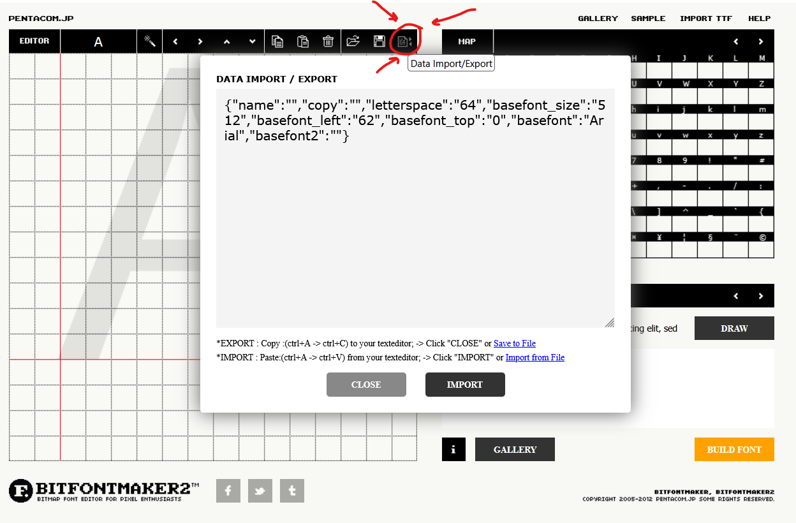

# Fonts

WizardTower.tff was generated using [BitFontMaker2](https://www.pentacom.jp/pentacom/bitfontmaker2/), 
a free bitmap font editor. The font file can be edited by importing the font data in WizardTower.txt
into BitFontMaker2.

